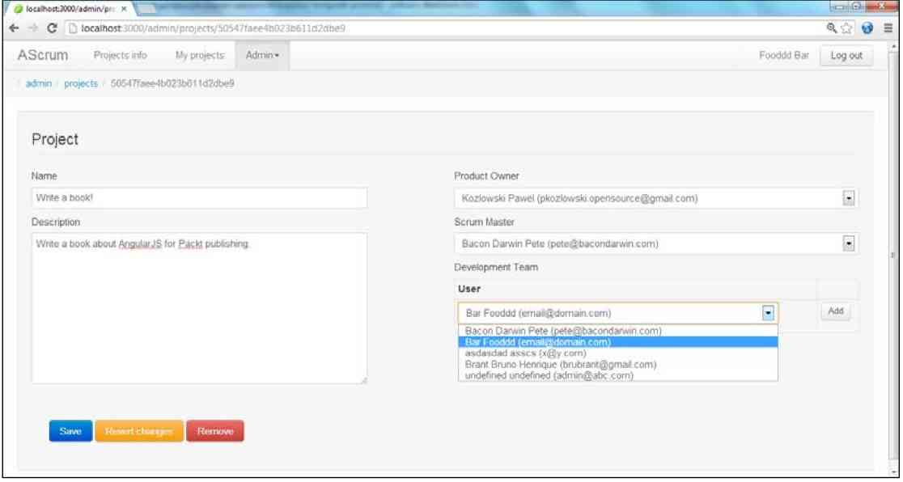

第二章
====
构建和测试
===

前一章我们介绍了AngularJS,覆盖的内容基本要素有,框架项目本身,背后的人,
基本使用场景.现在我们准备好去创建完整的,更复杂的WEB应用程序.本书的其余部分围绕着建造一个示例应用程序,它介绍了如何使用AngularJS在现实生活中的项目。

在下面的章节中，我们将构建一个简化的项目管理工具去支持Scrum敏捷软件开发方法。这个示例应用程序将帮助我们论证AngularJS API和习惯用法，以及覆盖典型的场景，诸如,和后端通信,组织导航,安全性,国际化,等等.本章要引入一个示例程序,它的问题的领域和使用的技术堆栈。

每个项目开始一些初步的决定文件组织策略，构建系统，雇用和基本工作流程。我们的示例应用程序是没有什么不同，我们本章将要讨论的构建系统和项目布局相关的专题.

自动化测试是坚实的工程实践是AngularJS和相关生态系统提升的.我们坚信自动化测试是强制的,对任何,但是最平常的项目.这就是为什么本章的最后部分要全力致力于测试:不同的类型,机制,工作流程,最佳实践和工具.

本章,我们将要学到:

*	本章使用的示例应用程序,它的问题领域和使用的技术堆栈.
*	为AngularJS web应用程序推荐的构建系统,以及相关工具和工作流程.
*	推荐的文件,目录,模块的组织.
*	自动化测试实践,不同类型的测试和他们在项目上的位置.
*	你会熟悉,测试用的通常用于AngularJS Web应用流程库和工具。

引入示例程序
===
这节我们会得到更多示例程序的细节,它将作为案例学习.

	    示例程序的源代码公开于git仓库,在GitHub中,
	    https://github.com/angular-app/angular-app.
	    该仓库包含完整的源代码,细致的安装指导和整个项目历史.
	   
	   
熟悉问题领域
---
为了展示AngularJS最有利的环境，我们要建立一个项目管理工具支持团队使用SCRUM方法.

		 AngularJS适用于使用框架去构建CRUD-相关的应用程序.
		 此应用程序包含很多的充满动态表单,列表,表格的屏幕.
		 

SCRUM是个流行的敏捷方法去运营项目,有希望的是很多读者都读过相关的内容.
对于的SCRUM新的内容,我们不必担心,因为SCRUM的基础很容易掌握.有许多优秀的书籍和文章，深入覆盖SCRUM,而是为了获得基本的理解它可能是足够了,过来介绍维基百科的文章的专题在<http://en.wikipedia.org/wiki/Scrum_(development)>

我们的示例应用程序的目的是协助团队管理SCRUM神器：项目和他们积压，冲刺和他们积压，任务，进度表，等等。该应用程序还具有一个功能齐全的管理模块来管理用户和项目工作。

	我们的示例应用程序不落下风的全面和严格遵守所有的Scrum原则。在必要的时候我们花几个快捷到清楚地说明AngularJS使用在建立一个真正Scrum项目管理工具的费用。
	
这个应用程序的,完成时,将会是如下的截屏:

	

看这个截屏,我们能立刻看到我们将要建造的是一个相当典型的CRUD方式的web应用程序:

*	获取,显示,编辑数据,来自持久层
*	身份认证和授权.
*	与所有支持的用户界面元素，如菜单，面包屑，相当复杂的导航架构。

技术堆栈
===
本书专注于AngularJS,但构建任何平凡web应用我们需要更多在浏览器中运行的JavaScript库.最低要求一个持久存储和后台服务架构.本书并不规定任何堆栈,我们确实认识到人脉使用AngularJS去连接不同的后端,服务端架构和持久存储.
尽管如此，我们不得不做出的选择来说明如何AngularJS融入一个更大的场景。

首先，我们选择尽可能使用JavaScript的友好技术.有很多优秀的后端平台和持久性存储在那里但我们想使我们例子为JavaScript开发者易于遵循跟进。此外，我们试图使用被视为JavaScript生态主流技术。
		  
		 在这本书中描述的协议栈和工具的所有元素是基于JavaScript的，
		 可以免费使用，开源项目。
		 
持久性存储
===
当涉及到数据存储有许多可供选择,最近NoSQL运动,只是一些替代中的一种。
对于这本书的目的我们要使用面向文档的MongoDB数据库,因为它非常适合进入面向JavaScript的环境：

*	文档存储为JSON方式的数据格式(二进制JSON- BSON).
*	查询和操作数据,用JavaScript和相似的JSON语法.
*	尽量导出REST端点的服务,并且处理数据用JSON格式.

本书的例子，不需要MongoDB的知识，我们会尽量解释棘手的地方，讨论的代码片段时候。
显而易见，我们建议MongoDB,或者面向文档nosql 数据库是更适合AngularJS应用程序。
AngularJS是后端与存储无关的。

MongoLab
---
MongoDB是相当容易起步的，大多数JavaScript开发者感觉在家一样，使用面向文档数据库。
为了更简便的处理示例程序，我们基于托管版本的MongDB。结果是无需安装软件，去运行本书的例子。

由多个基于云托管的MongoDB，我们发现MongoLab(<https://mongolab.com>)是可靠，易于启动，免费的数据库托管（数据库体积小与0.5GB）。MongoLab免费提供的存储空间，足够我们跑本书的示例了。
MongoLab 有一个或者多个不可忽视的优势；它提供REST服务的良好接口。我们讲会基于这个接口去展示AngularJS如何与REST端点通讯。

开始使用MongoLab，首先必要的是在线注册。这是个相当简单的过程，去填写短小的电子表格。
一旦注册完成。我们就可以享受接入托管的MongoDB数据库，通过JSON格式的REST接口，还有在线的管理控制台。

服务端环境
----
托管在MongoLab上的数据库，可以直接让AngularJS应用程序通过REST接口访问。对于非常小的项目，可以通过
浏览器直接访问MongoLab数据库；这不是很好的选择，对于其他实时，面向公众的应用程序。这是MongoLab提供的简单又不够安全的方式。

实际上，大多数AngularJS开发的UI都会和某些后台获取数据。中间件一般都会提供安全服务（认证）和验证权限（授权）。我们的示例应用并无不同，也需要一个后台。再一次，我们将押注于基于JavaScript的解决方案；node.js 。

node.js二进制版本适用于各种流行的操作系统。从<http://nodejs.org>下载二进制版本。你需要下载和安装node.js的运行环境到本机，才能运行本书的示例。

		介绍node.js已经超出本书的范围了。幸运的是node.js是非常简单的基础知识
		和它的包管理(node.js包管理-npm)是运行示例必须的。开发者熟悉了node.js后会
		发现很容易理解服务端后台的机制，虽然node.js的知识不是强制要求的。

除了node.js本身，我们讲要用node.js的库去构建示例应用的服务端组件。

*	Express（<http://expressjs.com/>）作为服务端web应用框架，它能提供路由，
	服务数据和静态资源。
*	Passport（<http://passportjs.org/>）作为node.js的安全中间件
*	Restler（<https://github.com/danwrong/restler>）作为node.js的HTTP客户端库。

当熟悉了node.js之后，提到的库，会非常有用，但并不是学AngularJS必须的。你可能想钻入node.js和列表上的库，假如你想获得更深入的理解服务端部分的示例。换句话说，你的工作涉及了使用不同的后端技术，你可以方向的忽略node.js的相关细节。

第三方JavaScript库
----
AngularJS可以独自使用去开发相当复杂的应用程序。在此同时，不需要重新发明轮子和重新实现流行的库。

示例程序尝试保持对外部库的独立依赖，第三方的库绝对是最小依赖了，然我们聚焦在AngularJS能做的。
很多项目，会使用著名的库 如 jQuery，underscore.js 等等。为了演示如何AngularJS可以共存与其他库兼容最新版本的jQuery到项目中。

Bootstrap CSS
---
AngularJS并不强制规定任何特定CSS的使用，以便任何人可以自由的设计应用的需要。
为了使我们的SCRUM应用看起来更时尚，我们使用流行的Twitter Bootstrap（<http://twitter.github.com/bootstrap/>） CSS。

示例应用包含了Bootstrap的 LESS模板，去描述如何LESS编译能包含在构建链上 。

构建系统
---

过去JavaScript被当做玩具语言使用。
近年来，JavaScript已经成为一种主流语言。每天正在编写和部署这些JavaScript开发的新的，庞大而复杂的应用。复杂度的增加意味着更多的代码要编写。
