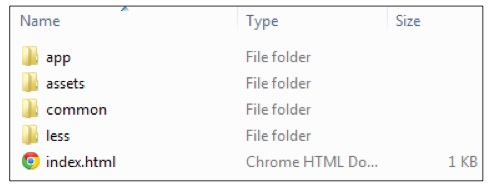
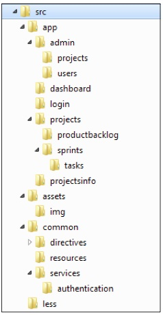

第二章
====
构建和测试
===

前一章我们介绍了AngularJS,覆盖的内容基本要素有,框架项目本身,背后的人,
基本使用场景.现在我们准备好去创建完整的,更复杂的WEB应用程序.本书的其余部分围绕着建造一个示例应用程序,它介绍了如何使用AngularJS在现实生活中的项目。

在下面的章节中，我们将构建一个简化的项目管理工具去支持Scrum敏捷软件开发方法。这个示例应用程序将帮助我们论证AngularJS API和习惯用法，以及覆盖典型的场景，诸如,和后端通信,组织导航,安全性,国际化,等等.本章要引入一个示例程序,它的问题的领域和使用的技术堆栈。

每个项目开始一些初步的决定文件组织策略，构建系统，雇用和基本工作流程。我们的示例应用程序是没有什么不同，我们本章将要讨论的构建系统和项目布局相关的专题.

自动化测试是坚实的工程实践是AngularJS和相关生态系统提升的.我们坚信自动化测试是强制的,对任何,但是最平常的项目.这就是为什么本章的最后部分要全力致力于测试:不同的类型,机制,工作流程,最佳实践和工具.

本章,我们将要学到:

*	本章使用的示例应用程序,它的问题领域和使用的技术堆栈.
*	为AngularJS web应用程序推荐的构建系统,以及相关工具和工作流程.
*	推荐的文件,目录,模块的组织.
*	自动化测试实践,不同类型的测试和他们在项目上的位置.
*	你会熟悉,测试用的通常用于AngularJS Web应用流程库和工具。

引入示例程序
===
这节我们会得到更多示例程序的细节,它将作为案例学习.

	    示例程序的源代码公开于git仓库,在GitHub中,
	    https://github.com/angular-app/angular-app.
	    该仓库包含完整的源代码,细致的安装指导和整个项目历史.
	   
	   
熟悉问题领域
---
为了展示AngularJS最有利的环境，我们要建立一个项目管理工具支持团队使用SCRUM方法.

		 AngularJS适用于使用框架去构建CRUD-相关的应用程序.
		 此应用程序包含很多的充满动态表单,列表,表格的屏幕.
		 

SCRUM是个流行的敏捷方法去运营项目,有希望的是很多读者都读过相关的内容.
对于的SCRUM新的内容,我们不必担心,因为SCRUM的基础很容易掌握.有许多优秀的书籍和文章，深入覆盖SCRUM,而是为了获得基本的理解它可能是足够了,过来介绍维基百科的文章的专题在<http://en.wikipedia.org/wiki/Scrum_(development)>

我们的示例应用程序的目的是协助团队管理SCRUM神器：项目和他们积压，冲刺和他们积压，任务，进度表，等等。该应用程序还具有一个功能齐全的管理模块来管理用户和项目工作。

	我们的示例应用程序不落下风的全面和严格遵守所有的Scrum原则。在必要的时候我们花几个快捷到清楚地说明AngularJS使用在建立一个真正Scrum项目管理工具的费用。
	
这个应用程序的,完成时,将会是如下的截屏:

	

看这个截屏,我们能立刻看到我们将要建造的是一个相当典型的CRUD方式的web应用程序:

*	获取,显示,编辑数据,来自持久层
*	身份认证和授权.
*	与所有支持的用户界面元素，如菜单，面包屑，相当复杂的导航架构。

技术堆栈
===
本书专注于AngularJS,但构建任何平凡web应用我们需要更多在浏览器中运行的JavaScript库.最低要求一个持久存储和后台服务架构.本书并不规定任何堆栈,我们确实认识到人脉使用AngularJS去连接不同的后端,服务端架构和持久存储.
尽管如此，我们不得不做出的选择来说明如何AngularJS融入一个更大的场景。

首先，我们选择尽可能使用JavaScript的友好技术.有很多优秀的后端平台和持久性存储在那里但我们想使我们例子为JavaScript开发者易于遵循跟进。此外，我们试图使用被视为JavaScript生态主流技术。
		  
		 在这本书中描述的协议栈和工具的所有元素是基于JavaScript的，
		 可以免费使用，开源项目。
		 
持久性存储
===
当涉及到数据存储有许多可供选择,最近NoSQL运动,只是一些替代中的一种。
对于这本书的目的我们要使用面向文档的MongoDB数据库,因为它非常适合进入面向JavaScript的环境：

*	文档存储为JSON方式的数据格式(二进制JSON- BSON).
*	查询和操作数据,用JavaScript和相似的JSON语法.
*	尽量导出REST端点的服务,并且处理数据用JSON格式.

本书的例子，不需要MongoDB的知识，我们会尽量解释棘手的地方，讨论的代码片段时候。
显而易见，我们建议MongoDB,或者面向文档nosql 数据库是更适合AngularJS应用程序。
AngularJS是后端与存储无关的。

MongoLab
---
MongoDB是相当容易起步的，大多数JavaScript开发者感觉在家一样，使用面向文档数据库。
为了更简便的处理示例程序，我们基于托管版本的MongDB。结果是无需安装软件，去运行本书的例子。

由多个基于云托管的MongoDB，我们发现MongoLab(<https://mongolab.com>)是可靠，易于启动，免费的数据库托管（数据库体积小与0.5GB）。MongoLab免费提供的存储空间，足够我们跑本书的示例了。
MongoLab 有一个或者多个不可忽视的优势；它提供REST服务的良好接口。我们讲会基于这个接口去展示AngularJS如何与REST端点通讯。

开始使用MongoLab，首先必要的是在线注册。这是个相当简单的过程，去填写短小的电子表格。
一旦注册完成。我们就可以享受接入托管的MongoDB数据库，通过JSON格式的REST接口，还有在线的管理控制台。

服务端环境
----
托管在MongoLab上的数据库，可以直接让AngularJS应用程序通过REST接口访问。对于非常小的项目，可以通过
浏览器直接访问MongoLab数据库；这不是很好的选择，对于其他实时，面向公众的应用程序。这是MongoLab提供的简单又不够安全的方式。

实际上，大多数AngularJS开发的UI都会和某些后台获取数据。中间件一般都会提供安全服务（认证）和验证权限（授权）。我们的示例应用并无不同，也需要一个后台。再一次，我们将押注于基于JavaScript的解决方案；node.js 。

node.js二进制版本适用于各种流行的操作系统。从<http://nodejs.org>下载二进制版本。你需要下载和安装node.js的运行环境到本机，才能运行本书的示例。

		介绍node.js已经超出本书的范围了。幸运的是node.js是非常简单的基础知识
		和它的包管理(node.js包管理-npm)是运行示例必须的。开发者熟悉了node.js后会
		发现很容易理解服务端后台的机制，虽然node.js的知识不是强制要求的。

除了node.js本身，我们讲要用node.js的库去构建示例应用的服务端组件。

*	Express（<http://expressjs.com/>）作为服务端web应用框架，它能提供路由，
	服务数据和静态资源。
*	Passport（<http://passportjs.org/>）作为node.js的安全中间件
*	Restler（<https://github.com/danwrong/restler>）作为node.js的HTTP客户端库。

当熟悉了node.js之后，提到的库，会非常有用，但并不是学AngularJS必须的。你可能想钻入node.js和列表上的库，假如你想获得更深入的理解服务端部分的示例。换句话说，你的工作涉及了使用不同的后端技术，你可以方向的忽略node.js的相关细节。

第三方JavaScript库
----
AngularJS可以独自使用去开发相当复杂的应用程序。在此同时，不需要重新发明轮子和重新实现流行的库。

示例程序尝试保持对外部库的独立依赖，第三方的库绝对是最小依赖了，然我们聚焦在AngularJS能做的。
很多项目，会使用著名的库 如 jQuery，underscore.js 等等。为了演示如何AngularJS可以共存与其他库兼容最新版本的jQuery到项目中。

Bootstrap CSS
---
AngularJS并不强制规定任何特定CSS的使用，以便任何人可以自由的设计应用的需要。
为了使我们的SCRUM应用看起来更时尚，我们使用流行的Twitter Bootstrap（<http://twitter.github.com/bootstrap/>） CSS。

示例应用包含了Bootstrap的 LESS模板，去描述如何LESS编译能包含在构建链上 。

构建系统
---

过去JavaScript被当做玩具语言使用。
近年来，JavaScript已经成为一种主流语言。每天正在编写和部署这些JavaScript开发的新的，庞大而复杂的应用。复杂度的增加意味着更多的代码要编写。
这些天，我们看的这些项目，包含成千上万的JavaScript代码。

不再推荐，在HTML文档上，只有一个JavaScript文件的情况。我需要构建系统。在部署到生成服务器之前，我们的JavaScript文件和CSS文件会遭受多次的检测，转换。
有些示例的转换包括：

*	JavaScript源代码必须检查是否符合编码标准，使用工具的工具比如jslint（<http://www.jslint.com>）,jshint(<http://www.jshint.com/>)或类似工具。
*	测试套件（Test suites）尽可能的经常执行，至少包含在每一次的构建的过程中。那样的测试工具和流程必须紧密集成在构建系统中。
*	有可能自动生成一些文件（比如示例中的CSS文件，从LESS模板中生成）。
*	文件可能被合并在一起，压缩后，优化浏览器的性能。

除了先前列出的步骤，在一个应用程序可以部署到生产服务器之前，通常有其他任务必须执行，如文件必须复制到最终目的地，文档更新，等等。在一个不平凡的项目，总是有许多艰苦的任务，我们应该尽量自动化。

构建系统的原则
===

开发人员喜欢编写代码，但在现实中，只有一小部分的时间，我们花在了一个文本编辑器前。相对于有趣的部分（设计，讨论，代码，bug修复），这儿有大量的疲于奔命的任务要经常执行。有时候非常多。构建一个应用程序，
是一个必须一遍遍执行的任务。所以最好是快速和不痛苦的。这里我们讨论一下管理我们的构建系统的原则。

自动化任何事
---

本书的作者，最不喜欢，人工执行，重复任务，一遍又一遍。我们很慢，犯错误，坦率的说，对这些苦差事容易感到厌烦。如果你像我们这样的，你会很容易地理解为什么我们坚信自动化构建过程中每一个可能的步骤。

计算机非常擅长重复性的工作；它不会执行错误的步骤，不需要咖啡时间，不被分心。我们的机器不会抱怨，我们
分担了大部分的任务给它们。投入到自动化每个可能步骤去构建系统的时间，都是马上有回报的，因为每天我们将会节省大量的时间。

快速失败，失败干净
---

典型的构建过程包括几个唯一的步骤。有些步骤会执行大多数的时间，一旦异常被发现，其他的步骤会失败。任务可能会在过程的早期，会失败，打断了构建过程。这保证了更多的耗时的步骤没有被执行。

我们艰难地学会了这些做事的规则是如此重要。初期，在`jshint`之前，示例应用服务的构建系统，被自动执行测试。我们经常发现我们都在等待所有的自动化测试案例去运行。经常发现构建过程被无效的JavaScript所打断。
解决方案是移动jshint任务到最开始的构建管道，尽可能的早发现。

最重要的是构建过程中断后要清理打印出来的异常消息。有了明确的错误消息，我们应该能够几秒钟内找出失败的根源。当我们做项目的时候，有没有比这更糟糕的事情呢，盯着神秘的错误信息，不知道如何解决。

不同的工作流，不同的命令
---

作为开发人员，我们都负责不同的任务。有一天，我们忙着添加新的代码（测试！），花费大量的时间集成新的功能之后。我们的构建系统应该反应这一现实，提供不同的命令，不同的工作流程。根据我们的经验，构建系统应该由3类构建任务：

1.	运行要快，断言代码要由正确性。在JavaScript项目中，这可能意味着运行`jslint/jshint`和执行
	单元测试。此命令应该是非常快，所以它可以执行得非常频繁。这个构建任务应该是非常由用的，开发代码使用测试驱动开发（TDD）方式。
2.	一个命令部署一个全功能的应用，用于测试目的：执行此生成任务后，我们应该能够在浏览器中运行的应用程序。为了做到这一点，我们需要做更多的处理，如生成CSS文件等。此任务是专注于构建一个UI相关的开发工作流程。
3.	生产部署构建任务应该运行在上一步中所有列出的核查以及编写一个应用程序的最终部署，如合并和缩小文件，执行集成测试，并依此类推。

构建脚本也是代码
---

构建脚本是项目的产出物的一部分。我们应该把它们与任何其他交付一样的爱护。构建脚本都必须可阅读，理解和维护 - 就像任何其他源代码。写的不好构建脚本地会显著减慢你的步骤，保证会有一些令人沮丧的调试会话。

工具
---
在上一节所述构建系统的设计原理，可以应用到任何项目，任何的工具集。我们选择的工具链是操作系统（OS）无关的，所以我们能运行示例应用程序或者流行的操作系统（OS）。

		  虽然我们已经选定了构建工具,在我们看来，示例项目最好的目的就是：
		  我们要明白,不同的项目使用不同的工具。其余的这本书和建议从这一章
		  应该仍然是相关的和容易适应不同的构建系统。
		  
Grunt.js
---
示例SCRUM应用程序的构建系统，装备了Grunt(<http://gruntjs.com>). `grunt.js`广告词：

		JavaScript项目，基于任务的命令行工具
		
对我们来说最重要的是`grunt.js`构建脚本是用JavaScript开发的，执行在`node.js` 平台。这是非常好的消息,这意味着我们可以使用相同的平台和相同的编程语言对于构建和运行示例应用程序。

Grunt属于面向任务构建工具的相同目录，如Gradle （Groovy开发的脚本）或者Rake（Ruby开发的脚本），		所以人们熟悉这些工具应该有家的感觉。

测试库和工具集
===

AngularJS使用，促进和鼓励自动化测试实践。AngularJS团队需要非常认真对待可测试性,他们确保他们编写的代码使用AngularJS容易测试。但整个可测试性在这里不停,AngularJS团队编写或扩展的工具以使测试容易在实践中。

Jasmine
---
Jasmine (<http://pivotal. github.com/jasmine/>). Jasmine是个测试JavaScript代码的框架，
它来源于行为驱动开发（BDD），并且影响了它的语法。

所有的例子在原始AngularJS文档使用的是Jasmine的语法,因此这个测试框架是一个自然的选择对我们的示例应用程序。此外,AngularJS写各种模拟对象和Jasmine的扩展提供了一个很好地集成,实用的日常测试经验。

Karma runner（运行器）
---
Karma runner (<http://karma-runner.github.io>) ，更易于执行JavaScript测试。Karma runner注定要取代其他流行的测试运行器（test runner）JS TestDriver带有稳定，纯JavaScript，node.js的解决方案。

Karma runner可以调度源和测试代码的运行一个浏览器实例(或开始一个新的如果需要!),触发执行的测试,测试结果和报告收集个人的最终结果。它使用真正的浏览器来执行测试。这是一个大的突破在JavaScript的世界,因为我们可以同时在几个浏览器执行测试,确保我们的代码将在野外操作正确。
	
			Karma runner是一个了不起的工具，基于它的稳定性和速度。
			它是用于AngularJS项目执行测试部分的持续集成构建。
			在每一个构建Karma runner 执行大约2000单元测试在多个浏览器上。
			总计14000测试被执行在大约20秒内。这些数字应该提高我们的信心：
			Karma runner作为一种工具,AngularJS作为一个框架。
			
测试是一个中心主题在AngularJS,我们要进一步深入查看Jasmine测试和Karma runner在本章后面。

组织文件和目录
===

到目前为止我们已经取得了一些非常重要的决策技术堆栈和使用到的工具,而构建示例应用程序,SCRUM现在,我们需要回答一个至关重要的问题,如何组织不同的文件在有意义的文件夹结构。

任何给定的项目有多种方式组织文件。有时我们做的选择,是因为一些现有的工具和框架强制规定的布局。但无论是`grunt.js`还是`AngularJS`都没有强加任何特定的目录结构,所以我们可以自由做出自己的选择。在接下来的段落,你可以找到一个提议，组织文件和依据后面这个提议。你可以选择使用前面描述的结构,在你未来的项目或调整它以适合您的特定需要。
		
		
根目录
---
在设计文件夹布局我们想最后一个目录结构,使它容易导航代码库中。同时我们需要保持在一个合理的水平建立复杂性。

这里有一些基本的假设引导我们的高级的目录结构:	

*	应用程序的源代码和相关测试应明确分开。这是保持构建系统易于维护,因为通常有不同的构建任务执行测试和源代码。
*	第三方代码的任何外部库应该清楚地隔离于我们内部的代码库。相对于我们的交付物，外部库应该不同的地方改变。我们想在任何时候都能容易的升级外部依赖。我们的源代码与外部库的混合会使得升级很困难和费时。
*	与构建相关的脚本应该驻留在自己的专用文件夹和不会散落在代码库。
*	构建结果应该输出到一个单独的文件夹。的内容和结构构建输出应密切匹配一个强制要求的生产部署需求。它应该很容易就抓住输出的构建和部署在其最终的目的地。

采取上述所有假设考虑，我们最终采用以下顶级目录项目:

*	src:包含应用的源代码
*	test:包含伴随的自动化测试
*	vendor: 第三方依赖库
*	build: 构建脚本
*	dist: 构建结果，准备部署到目标环境

最后，这样就是一个顶级目录结构的可视化：

除了上述文件夹我们可以注意到一些高级文件。这些文件仅供参考:

*	.gitignore: git SCM相关，包括规则指明哪个文件不应该被跟踪在一个git仓库。
*	LICENSE: 包括的MIT许可证。
*	Gruntfile.js: grunt.js文件的入口点。
*	packeage.json: node.js应用的包描述。

源代码的内部
----
基本的目录结果，深入到src目录。我们来看看：

`index.html `文件是应用程序的入口。这里有4个目录，2个是包含AngularJS相关的代码（`app`和`common`）和2个其他的包含AngularJS无关的表现层产出物(`assets`和`less`)。

这个`assets`和`less`目录，很好理解；首先`assets`包含图片和图标，第二个是LESS变量。请注意，Twitter的Bootstrap的CSS的LESS 模板，在`vendor`目录，这里只是放置变量的值。

AngularJS相关文件
---
AngularJS应用程序包含两类文件类型，有名字的脚本和HTML模板。所有重要项目将产生许多不同类型的文件,我们需要找到一种方法来组织这些大量的文件。理想情况下我们想让相关文件一起,让无关的远离。麻烦的是,文件可以有许多不同的方式联系在一起,我们已经有了只有一个目录树来表达这些关系。
常见的策略解决这个问题涉及文件的功能分组(包的功能),通过一个架构层(包被层),或者通过一个文件类型。我们想提出这是一个混合的方法:

*	大部分的应用程序文件应该是按照特性来组织。脚本和相关物,在功能上互相关联应该放在一起。
	这样的安排是非常方便的，同时致力于应用程序的垂直切片，从所有的文件一起改变，被组合在一起。
*	文件封装横切关注点(持久性存储访问,本地化,常见的指令等)应该被组合在一起。这里的依据是，基础
	设施相关的脚本，依附于功能代码，改变的速度不一致。在一个典型的应用程序生命周期，一些技术基础设施是写在早期，被关注的焦点转移到功能代码，作为应用程序的成熟度。文件在通用、基础设施水平区域是最好是组织在架构层。
	
我们可以直接转换上面的建议,下面的示例应用程序的目录结构:

	目录结构描述的，在这里不同于推荐方式的AngularJS seed 的项目(<http://github.com/angular/angular-seed>). angular-seed项目对简单的工程项目，比较适用，但是社区的共识，是大的工程项目，最好是按照专题来组织目录。

